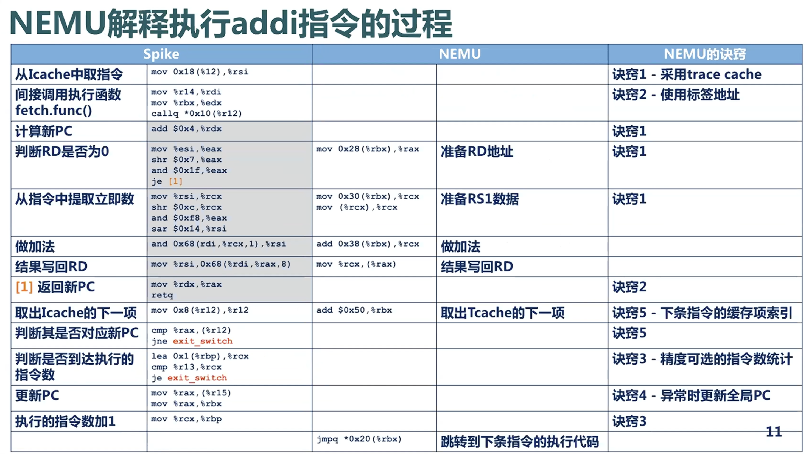

今天翻 B 站的“稍后再看”列表时，翻出了一个 2021 年收藏、但一直没认真看的老东西：

https://github.com/OpenXiangShan/NEMU

这是 NJU 推出的一个以教学为主要目标的 RISC-V64 模拟器。

Slides：https://www.bilibili.com/list/watchlater/?bvid=BV1Zb4y1k7RJ

这篇先当作一个入口帖，顺手记下我为什么又把它翻出来，以及目前看下来觉得比较值得记的点。

## 为什么又翻出这个

我在 2021 年那会儿其实对各种 Emulation 很感兴趣，比如 [NES 模拟器](https://www.emulator-zone.com/doc.php/nes/) 和 PS4 模拟器 [shadPS4](https://github.com/shadps4-emu/shadps4)。当时总想着“之后一定要系统研究一下”，结果兴趣面铺得太开，这个坑后来一直没真正填起来。

所以现在回头看，会有一种很典型的感觉：知道这东西很有意思，也隐约知道整体的设计流程，但如果真要让我把 Emulator 的一些核心实现细节讲清楚，其实又讲不太出来。

现在有了 AI，重新捡这些题目的启动成本确实低了不少。我打算先把上面的 Slides 过一遍，先建立一层比较高层次的理解：例如模拟器大致有哪些路线、性能瓶颈通常在哪里、常见优化技巧是什么。后面如果有机会，再找一个更具体的案例继续往下钻，比如主机模拟相关的实现。

后续我会把看 Slides 时记下来的知识点，也逐步补到这篇文章里。

## NEMU

[NEMU](https://www.bilibili.com/list/watchlater/?bvid=BV1Zb4y1k7RJ)

说实话，我现在已经不记得当年为什么会把它收藏起来了。不过既然重新翻到了，就顺手把它看一遍，也做点笔记。

下面是我目前对 NEMU 思路的一个简要整理。

### 两种常见路线

- 解释型 Emulator（如 Spike）：逐条指令模拟执行。优点是实现和调试都相对直接，缺点是执行速度通常比较慢。
- 翻译型 Emulator（如 QEMU）：以 basic block 为单位，把 guest 指令翻译成 host machine instructions 再执行。优点是性能更好，缺点是整体机制更复杂，分析和实现门槛也更高。

NEMU 的思路可以理解为在两者之间取一个折中，尽量兼顾可理解性和执行效率。下面这张图可以帮助建立一个直观印象：



### 一些值得记的点

#### 1. Trace cache（TCache）

把已经翻译好的本机指令缓存起来，避免重复经历“取指 -> 译码 -> 翻译”这条流程。

#### 2. 用间接跳转替代间接函数调用

这里的要点是：跳到执行函数时，使用间接跳转，而不是间接函数调用。

#### 3. 指令数统计支持多种精度

NEMU 支持三种粒度的指令数统计：

1. 不统计
2. 基本块末尾统计（不支持单步调试）
3. 逐指令统计

这类设计本质上是在统计精度和运行开销之间做权衡。

#### 4. 只在异常时更新全局 PC

TCache 内部已经记录了当前 PC，因此在正常执行路径上，不需要频繁回写全局 PC。

只有在异常场景下，例如 TLB miss，才去更新全局 PC。

#### 5. 在译码阶段预先计算下一条动态指令的 TCache 地址

这个点我还想再顺一遍，不过从思路上看，本质还是尽量把后续执行阶段的开销前移。

### RISC-V 相关优化

除了通用思路之外，NEMU 还对一些 RISC-V 指令做了定向优化。

例如，在译码阶段把 0 号寄存器重定向到一个无用变量。这样执行阶段就不必再额外判断目标寄存器是不是 0 号寄存器，从而少一次条件判断，也少一部分潜在的跳转开销。

**浮点指令模拟**：NEMU 提供了 `hostfloat`，也就是直接借用主机（比如 x86）的浮点运算来完成模拟；Spike 则使用 `softfloat`，即通过软件函数来模拟浮点行为，开销会更高一些。当然，直接使用宿主机浮点运算并不是完全没有代价，比如在 NaN 处理和误差细节上，x86 与目标架构之间可能会有一些差异，但整体上看影响通常可控。

### NEMU总结

上面Slides强调的主要是“如何高效地把 guest instruction 的语义在 host 上执行出来”，不过一般针对一个architecture的模拟器，里面自然还有其他关于模拟系统组件的设计。不过目前我就只总结Slides里谈到的知识点。

翻译流程基本上是：

```
instructions from another arch. (e.g., RISC-V)
-> translator / dispatcher
-> instructions or execution path on host machine (e.g., x86-64)
-> execute
```

和 PS4 模拟器不同，PS4 的 CPU 本身就是 x86-64，所以我理解它的重点应该不会像这里一样主要落在跨 ISA 翻译上，而更可能是在对 PS4 底层组件的逆向与恢复上，比如 API 调用、文件结构之类的问题。

所以对我来说，NEMU 这里最值得学的，主要还是一些比较high-level的优化技巧。只需要知道就行了，具体实现都有所差异，不必过多追求细节。
