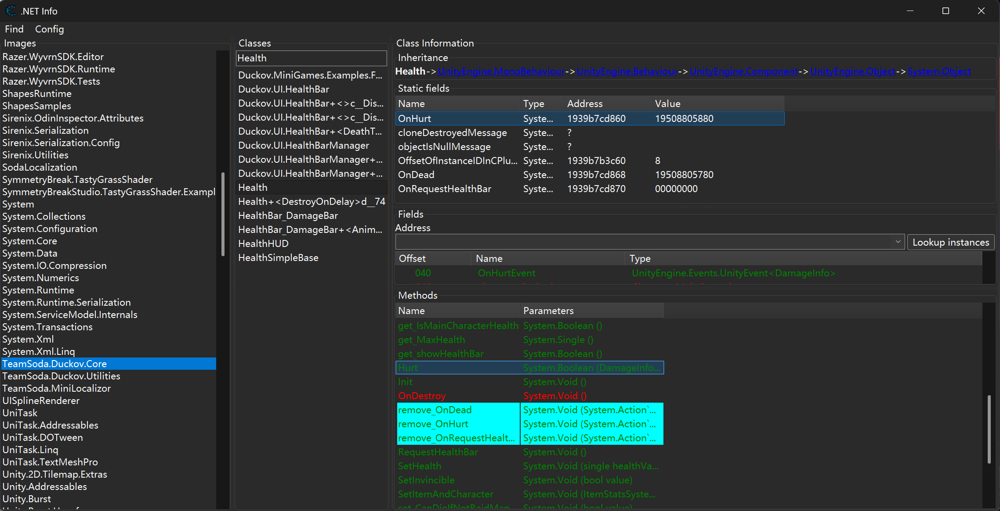
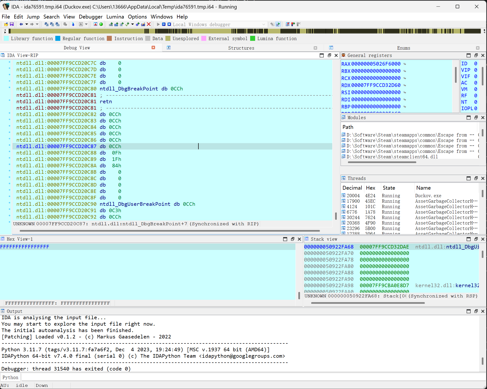

参考教程：https://www.bilibili.com/video/BV1vok1BFE9Z

这篇文章以一个具体案例为切入点，简单梳理游戏逆向中的一些基础概念，并走通一套相对完整的逆向分析与破解流程。

> Disclaimer: 《逃离鸭科夫》是单机游戏，本文内容仅用于学习和研究参考。

先启动 Duckov，然后在主界面使用 Cheat Engine 附加到游戏进程。

在菜单中选择 `Mono -> Activate mono features`。

接着打开 `Mono -> .Net Info`。

弹出的窗口里会显示 .NET 相关的各种信息，从 Images、Classes 到具体的方法。每一个方法都会被映射到当前进程中的实际地址。



如上图所示，我们的目标是“锁血”，也就是让敌人无法对玩家单位造成伤害。因此可以先把目标方法锁定为 `Health` 类中的 `Hurt` 方法。由于这个类会被所有单位继承，所以不能简单粗暴地直接 patch；必须加上一层判断逻辑，只在目标是玩家时跳过伤害，而对其他敌方单位仍然保持正常行为。

双击目标方法，打开反汇编视图：

```asm
Health:Hurt - 55                    - push rbp
Health:Hurt+1- 48 8B EC              - mov rbp,rsp
Health:Hurt+4- 48 81 EC 90060000     - sub rsp,00000690 { 1680 }
Health:Hurt+b- 48 89 5D C8           - mov [rbp-38],rbx
Health:Hurt+f- 48 89 75 D0           - mov [rbp-30],rsi
Health:Hurt+13- 48 89 7D D8           - mov [rbp-28],rdi
Health:Hurt+17- 4C 89 65 E0           - mov [rbp-20],r12
Health:Hurt+1b- 4C 89 6D E8           - mov [rbp-18],r13
Health:Hurt+1f- 4C 89 75 F0           - mov [rbp-10],r14
Health:Hurt+23- 4C 89 7D F8           - mov [rbp-08],r15
```

函数起始地址是 `194B2942670`。

记下这个地址后，再用 IDA Pro 附加到进程里看伪代码。毕竟原始反汇编又长又杂，直接硬读体验并不好。



直接跳转到地址 `194B2942670`，然后反编译。


```c
__int64 __fastcall sub_194B2942670(__int64 a1, __int64 a2)
{
    /* var decl fields omitted */

  v67[0] = 0i64;
  v67[1] = 0i64;
  v68 = 0i64;
  v69 = 0i64;
  v59 = 0.0;
  v70 = 0i64;
  v71 = 0i64;
  if ( (unsigned int)((__int64 (__fastcall *)(_QWORD, _QWORD))loc_194A87D3CE7)(unk_194FE20FF60, 0i64)
    && *(_BYTE *)(unk_194FE20FF60 + 97i64) )
  {
    return 0i64;
  }
  if ( *(_BYTE *)(a1 + 125) )
    return 0i64;
  if ( *(_BYTE *)(a1 + 116) )
    return 0i64;
  if ( (unsigned int)((__int64 (__fastcall *)(_QWORD, _QWORD))loc_194A87D3CE7)(*(_QWORD *)(a2 + 112), 0i64)
    && *(float *)(a2 + 104) > (double)((float (*)(void))unk_194B27520CE)() )
  {
    ((void (__fastcall *)(__int64, _QWORD, _QWORD, _QWORD))unk_194B2944986)(
      a1,
      *(_QWORD *)(a2 + 112),
      *(_QWORD *)(a2 + 56),
      *(int *)(a2 + 100));
  }

// Omitting following logic
```

其中，`if ( *(_BYTE *)(a1 + 125) )` 对应的是 `Health` 类中的字段：

`07d invincible System.Boolean`

`074 isDead System.Boolean`

一旦命中这两个条件，后续就不会再对该单位继续造成伤害。

剩下的逻辑分析起来还是比较费劲，所以这里换用 DnSpy，直接去看 JIT 之前的 IL 层代码。

把 `Escape from Duckov\Duckov_Data\Managed\TeamSoda.Duckov.Core.dll` 直接拖进 DnSpy，然后找到 `Health::Hurt()` (见附录)

看到这里，基本已经接近源码级别的信息了。

重点看这一段：

```c#
	if (!damageInfo.ignoreDifficulty && this.team == Teams.player)
	{
		damageInfo.damageValue *= LevelManager.Rule.DamageFactor_ToPlayer;
	}
```

可以看出，它的判断逻辑是 `this.team == Teams.player`。换句话说，我们只需要读取 `team` 字段并据此做判断就够了。

```c#
using System;

// Token: 0x0200007A RID: 122
public enum Teams
{
	// Token: 0x040003ED RID: 1005
	player,
	// Token: 0x040003EE RID: 1006
	scav,
	// Token: 0x040003EF RID: 1007
	usec = 3,
	// Token: 0x040003F0 RID: 1008
	bear,
	// Token: 0x040003F1 RID: 1009
	middle,
	// Token: 0x040003F2 RID: 1010
	lab,
	// Token: 0x040003F3 RID: 1011
	all,
	// Token: 0x040003F4 RID: 1012
	wolf
}
```

枚举默认从 `0` 开始，因此 `Teams::player` 的值就是 `0`。

回到 CE 里继续查字段：

`050 team Teams`

也就是说，这个字段位于 `0x50` 偏移处。

接下来就是写 hook。常见做法有两个：

1. 直接用 CE 写注入脚本。
2. 用 Frida 做动态注入。

Frida那个其实更原始一点，需要自己去allocate memory，自己从头到尾把code injection的pipeline走完。所以我这里直接用CE做了。

### CE Auto Assembler注入

思路很简单：在函数 prologue 之后注入 hook，并加入如下判断：

```
if is_player():
    invincible=True # set invincible to True.
else:
    continue # resume normal control flow
```

打开 `Memory Viewer -> Tools -> Auto Assembler`。

这里的目标是做 Code Injection，所以直接使用 Code Injection Template 就行，省事很多。

我这里选择在下面这条指令处注入：

```
Health:Hurt+2a - 48 89 95 A8F9FFFF     - mov [rbp-00000658],rdx
```

注入最好在第一个basic block，重点在于必须确保此时 `rcx` 仍然指向 `this` 指针。

```
alloc(newmem,2048,Health:Hurt+2a) 
label(returnhere)
label(originalcode)
label(exit)
label(is_other)

newmem: //this is allocated memory, you have read,write,execute access
//place your code here
push rdx
mov edx, [rcx+50]
cmp edx, 0
jne is_other
// is player
mov byte ptr [rcx+7d], 1

is_other:
pop rdx

originalcode:
mov [rbp-00000658],rdx

exit:
jmp returnhere

Health:Hurt+2a:
jmp newmem
nop 2
returnhere:
```

## 附录

```c#
// Health
// Token: 0x06000408 RID: 1032 RVA: 0x00011DB0 File Offset: 0x0000FFB0
public bool Hurt(DamageInfo damageInfo)
{
	if (MultiSceneCore.Instance != null && MultiSceneCore.Instance.IsLoading)
	{
		return false;
	}
	if (this.invincible)
	{
		return false;
	}
	if (this.isDead)
	{
		return false;
	}
	if (damageInfo.buff != null && UnityEngine.Random.Range(0f, 1f) < damageInfo.buffChance)
	{
		this.AddBuff(damageInfo.buff, damageInfo.fromCharacter, damageInfo.fromWeaponItemID);
	}
	bool flag = LevelManager.Rule.AdvancedDebuffMode;
	if (LevelManager.Instance.IsBaseLevel)
	{
		flag = false;
	}
	float num = 0.2f;
	float num2 = 0.12f;
	CharacterMainControl characterMainControl = this.TryGetCharacter();
	if (!this.IsMainCharacterHealth)
	{
		num = 0.1f;
		num2 = 0.1f;
	}
	if (flag && UnityEngine.Random.Range(0f, 1f) < damageInfo.bleedChance * num)
	{
		this.AddBuff(GameplayDataSettings.Buffs.BoneCrackBuff, damageInfo.fromCharacter, damageInfo.fromWeaponItemID);
	}
	else if (flag && UnityEngine.Random.Range(0f, 1f) < damageInfo.bleedChance * num2)
	{
		this.AddBuff(GameplayDataSettings.Buffs.WoundBuff, damageInfo.fromCharacter, damageInfo.fromWeaponItemID);
	}
	else if (UnityEngine.Random.Range(0f, 1f) < damageInfo.bleedChance)
	{
		if (flag)
		{
			this.AddBuff(GameplayDataSettings.Buffs.UnlimitBleedBuff, damageInfo.fromCharacter, damageInfo.fromWeaponItemID);
		}
		else
		{
			this.AddBuff(GameplayDataSettings.Buffs.BleedSBuff, damageInfo.fromCharacter, damageInfo.fromWeaponItemID);
		}
	}
	bool flag2 = UnityEngine.Random.Range(0f, 1f) < damageInfo.critRate;
	damageInfo.crit = (flag2 ? 1 : 0);
	if (!damageInfo.ignoreDifficulty && this.team == Teams.player)
	{
		damageInfo.damageValue *= LevelManager.Rule.DamageFactor_ToPlayer;
	}
	float num3 = damageInfo.damageValue * (flag2 ? damageInfo.critDamageFactor : 1f);
	if (damageInfo.damageType != DamageTypes.realDamage && !damageInfo.ignoreArmor)
	{
		float num4 = flag2 ? this.HeadArmor : this.BodyArmor;
		if (characterMainControl && LevelManager.Instance.IsRaidMap)
		{
			Item item = flag2 ? characterMainControl.GetHelmatItem() : characterMainControl.GetArmorItem();
			if (item)
			{
				item.Durability = Mathf.Max(0f, item.Durability - damageInfo.armorBreak);
			}
		}
		float num5 = 1f;
		if (num4 > 0f)
		{
			num5 = 2f / (Mathf.Clamp(num4 - damageInfo.armorPiercing, 0f, 999f) + 2f);
		}
		if (characterMainControl && !characterMainControl.IsMainCharacter && damageInfo.fromCharacter && !damageInfo.fromCharacter.IsMainCharacter)
		{
			CharacterRandomPreset characterPreset = damageInfo.fromCharacter.characterPreset;
			CharacterRandomPreset characterPreset2 = characterMainControl.characterPreset;
			if (characterPreset && characterPreset2)
			{
				num5 *= characterPreset.aiCombatFactor / characterPreset2.aiCombatFactor;
			}
		}
		num3 *= num5;
	}
	if (damageInfo.elementFactors.Count <= 0)
	{
		damageInfo.elementFactors.Add(new ElementFactor(ElementTypes.physics, 1f));
	}
	float num6 = 0f;
	foreach (ElementFactor elementFactor in damageInfo.elementFactors)
	{
		float factor = elementFactor.factor;
		float num7 = this.ElementFactor(elementFactor.elementType);
		float num8 = num3 * factor * num7;
		if (num8 < 1f && num8 > 0f && num7 > 0f && factor > 0f)
		{
			num8 = 1f;
		}
		if (num8 > 0f && !this.Hidden && PopText.instance)
		{
			GameplayDataSettings.UIStyleData.DisplayElementDamagePopTextLook elementDamagePopTextLook = GameplayDataSettings.UIStyle.GetElementDamagePopTextLook(elementFactor.elementType);
			float size = flag2 ? elementDamagePopTextLook.critSize : elementDamagePopTextLook.normalSize;
			Color color = elementDamagePopTextLook.color;
			PopText.Pop(num8.ToString("F1"), damageInfo.damagePoint + Vector3.up * 2f, color, size, flag2 ? GameplayDataSettings.UIStyle.CritPopSprite : null);
		}
		num6 += num8;
	}
	damageInfo.finalDamage = num6;
	if (this.CurrentHealth < damageInfo.finalDamage)
	{
		damageInfo.finalDamage = this.CurrentHealth + 1f;
	}
	this.CurrentHealth -= damageInfo.finalDamage;
	UnityEvent<DamageInfo> onHurtEvent = this.OnHurtEvent;
	if (onHurtEvent != null)
	{
		onHurtEvent.Invoke(damageInfo);
	}
	Action<Health, DamageInfo> onHurt = Health.OnHurt;
	if (onHurt != null)
	{
		onHurt(this, damageInfo);
	}
	if (this.isDead)
	{
		return true;
	}
	if (this.CurrentHealth <= 0f)
	{
		bool flag3 = true;
		if (!LevelManager.Instance.IsRaidMap && !this.CanDieIfNotRaidMap)
		{
			flag3 = false;
		}
		if (!flag3)
		{
			this.SetHealth(1f);
		}
	}
	if (this.CurrentHealth <= 0f)
	{
		this.CurrentHealth = 0f;
		this.isDead = true;
		if (LevelManager.Instance.MainCharacter != this.TryGetCharacter())
		{
			this.DestroyOnDelay().Forget();
		}
		if (this.item != null && this.team != Teams.player && damageInfo.fromCharacter && damageInfo.fromCharacter.IsMainCharacter)
		{
			EXPManager.AddExp(this.item.GetInt("Exp", 0));
		}
		UnityEvent<DamageInfo> onDeadEvent = this.OnDeadEvent;
		if (onDeadEvent != null)
		{
			onDeadEvent.Invoke(damageInfo);
		}
		Action<Health, DamageInfo> onDead = Health.OnDead;
		if (onDead != null)
		{
			onDead(this, damageInfo);
		}
		base.gameObject.SetActive(false);
		if (damageInfo.fromCharacter && damageInfo.fromCharacter.IsMainCharacter)
		{
			Debug.Log("Killed by maincharacter");
		}
	}
	return true;
}
```


## Ideas

1. 能不能把 Cheat Engine 和 MCP 结合起来？
2. 是否可以定制 Cheat Engine，做一些简单的检测绕过？
3. 能不能把 `.Net Info` 自动导出来？目前 CE 本身没有提供这个能力。
4. 是否可以写一个小脚本，把伪代码里很长的变量定义区折叠掉，方便阅读？
